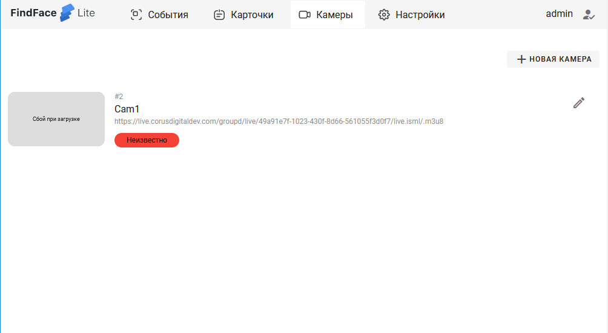
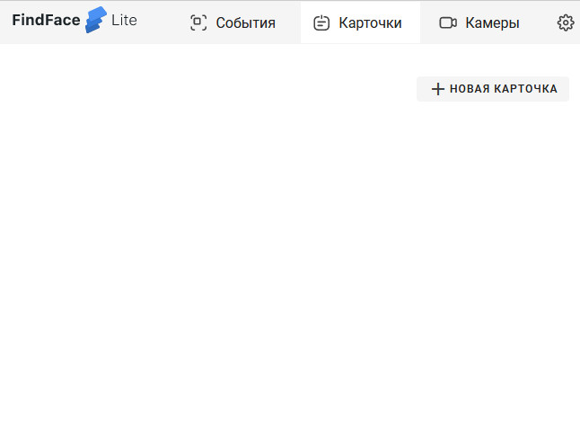
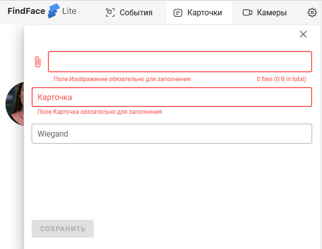

Быстрый старт FindFace Lite (FF.Lite) руководство по развертыванию системы
==========================================================================

В данном руководстве вы узнаете как быстро приступить к работе с FindFace Lite.

.. Содержание:

 .. toctree::
    :maxdepth: 4
    
    add1
    add2

О системе
---------

FindFace Lite – это облегченная версия основной многофункциональной системы видеоаналитики `Find Face Multi <https://docs.ntechlab.com/projects/ffmulti/>`_.

Данная система распознает лица, детали предметов,силуэты, номера и прочие детали из видеопотока видеокамеры или видеозаписи.

В основе данных систем находится передовая технология распознавания на базе искусственного интеллекта `FindFace Enterprise Server <https://docs.findface.pro/projects/ffserver/ru/4.0.3/>`_.

FindFace находит своё применение в частном и государственном секторе при администрировании зданий, помогает обеспечивать безопасность, контролировать проходные, парковки, распознавать лица людей, марки и номера машин, отслеживать определенные события. Повышает эффективность и служит хорошим помощником при идентификации посетителей, контролировании доступа, предупреждении мошенничества, аналитики клиентов и ускорять их обслуживание.

FindFace Lite обладает своим API - инструментом по интеграции для встраивания в другие системы и ПО.

FindFace Lite поставляется в двух версиях CPU и GPU.

CPU - легче чем GPU и проще устанавливается. Рекомендуется для первого знакомства с системой FindFace Lite. Основное отличие CPU от GPU в скорости распознавания, GPU быстрее обрабатывает события.

Версия GPU - более тяжелая версия , так как включает в себя библиотеки для быстрой работы. Данная версия рекомендуется, если вам нужно тщательное ознакомление с работой системы.


С чего начать
-------------

Для развертывания системы FindFace Lite нам будут нужны:

.. _`установочный пакет FF.Lite`:

* установочный пакет FF.Lite версии CPU. Файл вида ``fflite-dist-cpu*.tar.gz``

.. _`файл лицензии`:

* файл лицензии FF.Lite. Файл вида ``*.lic``

.. _`файл инсталлятора FF.Lite`:

* инсталлятор FF.Lite версии CPU. Файл вида ``fflite-cpu-master*.run``

FindFace Lite устанавливается на операционную систему Linux (Ubuntu).

Перед запуском необходимо установить ``Docker`` с плагином ``Compose``.

Если всё это для вас незнакомые слова, то вам лучше пригласить вашего друга или специалиста, разбирающегося в операционной системе Linux.


Подготовка к установке
----------------------

И так, вы знакомы с Linux, и у вас возникает приятное тёплое ощущение в пальцах при виде командной строки.

Тогда приступаем:

1. `Устанавливаем Docker версии не ниже 19.03 <https://docs.docker.com/engine/install/#server>`_

2. `Устанавливаем  Compose версии от 2.2.3 <https://docs.docker.com/compose/install/linux/>`_

Детальное описание установки можно посмотреть в ``Приложении 1``.

Compose должен вызываться через ``docker compose``.
 * Если вам нужно установить GPU версию, то тогда устанавливаем `NVIDIA Docker Runtime <https://docs.nvidia.com/datacenter/cloud-native/container-toolkit/install-guide.html>`_ и драйвера NVIDIA.
Инструкция - `здесь <https://docs.nvidia.com/datacenter/cloud-native/container-toolkit/install-guide.html>`_.

Для версии CPU нет необходимости устанавливать дополнения NVIDIA.


Установка FF.Lite
-----------------

У нас есть два варианта: установка из архива либо через инсталлятор.


Установка через инсталлятор
~~~~~~~~~~~~~~~~~~~~~~~~~~

Данный вариант подходит, если вы обладаете правами просматривать и изменять файлы в корневом каталоге.

1. Копируем `установочный пакет FF.Lite`_ , `файл лицензии`_ и `файл инсталлятора FF.Lite`_ в домашний каталог ``~/``.

2. Изменяем атрибуты у файла инсталлятора, установив у него атрибут запуска.

``chmod +x fflite-cpu-master*.run``


Убедитесь, что в каталоге лежит только один файл инсталлятора. Если это не так, оставьте только тот, который будете запускать. Остальные переместите в другой каталог.


3. Запускаем данный пакет из командной строки предпочтительно через ``sudo``.

``sudo ./fflite-cpu-master*.run``

Далее следуем инструкциям инсталлятора.

Пошаговое руководство приведено далее в ``Приложении 2``.


Установка из архива
~~~~~~~~~~~~~~~~~~~

1. Копируем `установочный пакет FF.Lite`_ в домашний каталог ``~/``.

2. Проверим, что в этом каталоге находится только один архив вида `fflite-dist-cpu*/tar.gz` и нет в каталога ``~/fflite``.

Если это так, тогда переходим к третьему шагу.

3. Распаковываем архив в домашний каталог ``~/``.


```bash
tar zxvf fflite-dist-cpu*.tar.gz
```

Архив будет распакован в каталог ``~/fflite``.

4. Копируем файл лицензии ``.lic`` в папку ``~/fflite/license``.

5. Переходим в каталог

``cd ~/fflite``

6. Запускаем установку из командной строки

```bash setup.sh```

Программа установки проверит соответствие необходимым требованиям и наличию необходимого ПО.

После установки будет создан пользователь admin и присвоен ему пароль в системе FF.Lite.

5. Скопируйте пароль в надёжное место.

Позже вы сможете сами создавать и удалять аккаунты пользователей.

инсталлятор поднимает локальный HTTP-сервер с доступом через браузер.

Если у вас есть выделенный статический IP-адрес, то вы сможете подключиться к системе FF.Lite через интернет по IP.


Начало работы
-------------
#. Открываем браузер и заходим по своему IP в FF.Lite. Система сразу предложит авторизоваться.
#. Вводим логин ``admin`` и пароль, полученные при установке.

Итак, мы в системе распознавания FF.Lite.

Далее мы опишем основные шаги по установке камер, добавлению досье (картотеки) и проверки работы FF.Lite.


Основные шаги
~~~~~~~~~~~~~

На экране вверху находится основное меню: ``События``, ``Карточки``, ``Камеры``, ``Настройки``.
В правом верхнем углу мы видим имя пользователя под которым мы вошли в систему.

.. image:: img/lt-01.jpg
   :alt: Основной экран
   :align: center
   :scale: 55%
Основной экран

Первое, что нам нужно сделать - это добавить видеопоток, который будем просматривать и обрабатывать.


Добавляем видеокамеру (видеопоток)
""""""""""""""""""""""""""""""""""

Для этого нам потребуется установленная IP-видеокамера с прямой ссылкой на её видеопоток.
Видеопоток может быть не только с видеокамеры, это может быть онлайн трансляция либо архивные видеозаписи.

После того как мы получили ссылку на видеопоток переходим в меню ``Камеры`` на основном экране  FF.Lite. Экран пока пустой с одной лишь кнопкой ``+Новая камера``.
После добавления видеопотоков с видеокамер здесь будет полный список.

.. image:: img/lt-03-0.jpg
   :alt: Экран Камеры
   :align: center
   :scale: 55%
Экран Камеры


Нажимаем ``+Новая камера``. В появившемся окне вводим в первой строке название камеры или видеопотока. Во вторую строку копируем ссылку на видеопоток. И нажимаем внизу ``Сохранить``.

.. image:: img/lt-03-1.jpg
   :alt: Экран добавления видеопотока
   :align: center
   :scale: 55%
Экран добавления видеопотока


.. image:: img/lt-03-2.jpg
   :alt: Пример заполнения
   :align: center
   :scale: 55%
Пример заполнения


На экране появится строка с миниатюрой потока, названием и введенной ссылкой на видеопоток.

Если подключение прошло успешно слева будет транслироваться изображение потока.

Если подключение не состоялось, то в миниатюре будет информация о подключении и под ссылкой на поток появится статус подключения.

.. image:: img/lt-03-3.jpg
   :alt: Пример списка подключенных потоков
   :align: center
   :scale: 55%
Пример списка подключенных потоков

Можно отредактировать настройки видеопотока. Для этого нажимаем справа в соответствующей строке видеопотока на иконку редактирования |карандаш|

Удаление видеопотока:

#. Открываем настройки видеопотока, нажав на иконку |карандаш|
#. В правом нижнем углу нажимаем изображение корзины |корзина|
#. Подтверждаем удаление.


Редактирование или удаление потока


Добавляем досье (картотеку)
"""""""""""""""""""""""""""

Для формирования картотеки нам будут нужны заранее заготовленные фотографии людей, машин или других предметов, которые нам нужно искать в видеопотоках.

Лицо или предмет должны быть в положении, близком к фронтальному.

Кстати, в версии `Find Face Multi <https://docs.ntechlab.com/projects/ffmulti/>`_ есть дополнительные инструменты для добавления и работы с большими объемами карточек.

При совпадении с карточкой система FF.Lite будет нас уведомлять о произошедшем событии. О Событиях мы расскажем в следующем разделе. А пока приступим к созданию карточек.

На основном экране FF.Lite  переходим в раздел ``Карточки``.

.. image:: img/lt-02-0.jpg
   :alt: Экран Карточки
   :align: center
   :scale: 55%
Экран Карточки

Так же как и при добавлении видеопотока нажимаем ``+Новая карточка``.

   
Открывается окно, в котором нужно прикрепить фотографию или фотографии того, что нужно искать.

Поддерживаемые форматы: WEBP, JPG, BMP, PNG

Фотографии должны быть качественная ``**(размеры?)**``

Во второй строке вводим название карточки.

Название может быть как имя сотрудника, так и марка машины.
Главное, чтобы было четко понятно о чем идет речь.

В третьей строке нужно дать подсказку системе, что это за объект Лицо или какой другой предмет - выбираем из выпадающего списка.


Экран добавления карточки


Когда карточка полностью заполнена активируется кнопка ``Сохранить``. Нажимаем её.

Карточка добавляется в общий список.


Пример заполнения и редактирования


Для редактирования карточки нажимаем справа в соответствующей строке на иконку редактирования |карандаш|

Удаление карточки:

#. Открываем настройки карточки, нажав на иконку |карандаш|
#. В правом нижнем углу нажимаем изображение корзины |корзина|
#. Подтверждаем удаление.


Просмотр событий
""""""""""""""""

Когда FF.Lite находит в видео потоке то, что мы записали в карточки, тогда на экране ``События`` начинают отображаться записи о всех совпадениях с указанием времени и названия карточки.
В событиях также отражается информация о статусах видеопотоков.

Детали по каждому событию можно посмотреть, если нажать строку события.

.. image:: img/lt-01.jpg
   :alt: Экран События
   :align: center
   :scale: 55%
Экран События

Настройки
"""""""""

Перейдя в раздел ``Настройки`` можно выбрать темную или светлую тему, а также язык интерфейса. В FF.Lite версии 1.2 интерфейс доступен на трех языках: русский, английский, испанский.

.. image:: img/lt-04-0.jpg
   :alt:  Экран Настройки
   :align: center
   :scale: 55%
Экран Настройки


Выход из системы
""""""""""""""""

Для выхода из системы в правом верхнем углу нужно нажать на изображение.
Откроется окно с кнопкой ``Выйти из аккаунта``. Нажимаем ее и выходим из системы под данной учетной записью.


Экран Выхода из системы


Примечание: Обычно нет необходимости выходить из системы, поэтому достаточно просто закрыть текущее окно в браузере. Выход из аккаунта необходим только в случае, если вам нужно зайти под другой учетной записью.


.. |карандаш| image:: img/lt-00-01.jpg

.. |корзина| image:: img/lt-00-02.jpg
