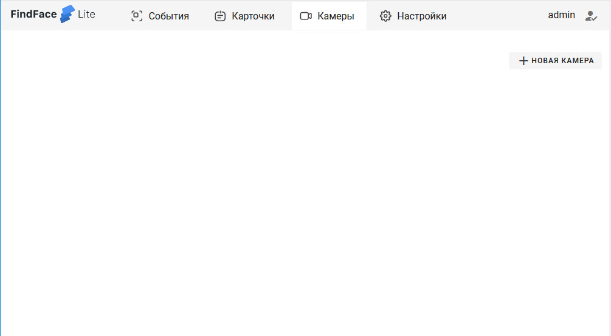
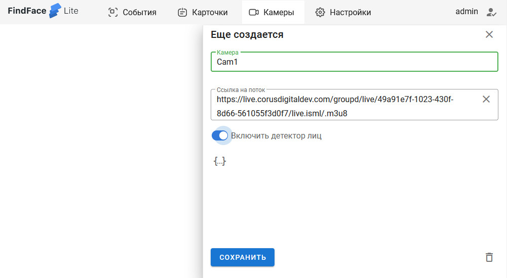
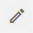

Быстрый старт FindFace Lite (FF.Lite) руководство по развертыванию системы
==========================================================================

В данном руководстве вы узнаете как быстро приступить к работе с FindFace Lite.

Содержание:

 .. toctree::
    
    index
    

О системе
---------

FindFace Lite – это облегченная версия основной многофункциональной системы видеоаналитики `Find Face Multi <https://docs.ntechlab.com/projects/ffmulti/>`_.

Cистема FindFace Lite предназначена для распознавания лиц и государственных регистрационных знаков транспортных средств (ГРЗ) из видеопотока. Это отличает FindFace Lite от `Find Face Multi <https://docs.ntechlab.com/projects/ffmulti/>`_, которая распознает лица, детали предметов,силуэты, номера и прочие детали из видеопотока видеокамеры или видеозаписи.

В основе данных систем находится передовая технология распознавания на базе искусственного интеллекта `FindFace Enterprise Server <https://docs.findface.pro/projects/ffserver/ru/4.0.3/>`_.

FindFace Light - это готовое коробочное решение для интеграторов и разработчиков, занимающихся созданием продуктов и сервисов с собственной бизнес-логикой. FindFace Light обладает собственным API и просто встраивается в проектные решения, помогая решать задачи распознавания.

FindFace Light применяется в системах контроля учета доступа (СКУД), системах учета рабочего времени (УРВ) по лицу. Используется для автоматизированного контроля паркинга по номерам, ведению черных и белых списков, Интегрируется в существующие системы безопасности и системы автоматизации управления персоналом: данные для WFM и ERP-систем.

FindFace Lite поставляется в двух версиях CPU и GPU.

CPU - менее требовательна к характеристикам аппаратной части, чем GPU. Основное отличие CPU от GPU в скорости распознавания, GPU быстрее обрабатывает события.

Версия GPU - более тяжелая версия , так как включает в себя библиотеки для быстрой работы. 
И потому GPU работает быстрее при больших нагрузках..

С чего начать
-------------

Для развертывания системы FindFace Lite потребуется:

.. _`установочный пакет FF.Lite`:

* установочный пакет FF.Lite версии CPU. Файл вида ``fflite-dist-cpu*.tar.gz`` либо версии GPU. Файл вида ``fflite-dist-gpu*.tar.gz``

.. _`файл лицензии`:

* файл лицензии FF.Lite. Файл вида ``*.lic``

.. _`файл инсталлятора FF.Lite`:

* инсталлятор FF.Lite версии CPU. Файл вида ``fflite-cpu-*.run``

FindFace Lite устанавливается на операционную систему Linux (Ubuntu).

Перед запуском необходимо установить ``Docker`` с плагином ``Compose``. Подробное описание установки данных пакетов в следующем разделе.

Подготовка к установке
----------------------

Здесь и далее описывается процесс установки на  Linux (Ubuntu) ``x86_64 (amd64)``.
Если вы используете другую операционную систему, тогда смотрите соответствующий раздел на сайте разработчика. Ссылки на сайт разработчика указаны в соответствующих разделах установки.

И так, у вас установлена Linux (Ubuntu), тогда приступаем:

Шаг 1. Устанавливаем Docker версии не ниже 19.03 

`Инструкция разработчика <https://docs.docker.com/engine/install/#server>`_

Для установки Docker требуется версия Ubuntu не ниже приведенных далее:

* Ubuntu Jammy 22.04 (LTS)
* Ubuntu Impish 21.10
* Ubuntu Focal 20.04 (LTS)
* Ubuntu Bionic 18.04 (LTS)

1) Удаляем ранее установленную версию Docker: сервисы``docker``, ``docker.io,`` или ``docker-engine`` должны быть удалены:

``sudo apt-get remove docker docker-engine docker.io containerd runc``.

Все конфигурационные файлы, контейнеры и прочее, сохраненное в ``/var/lib/docker/`` автоматически не удаляются. Если вам нужна чистая установка Docker,  тогда удаляем пакеты ``Docker Engine``, ``CLI``, ``containerd``, ``Docker Compose`` и каталоги конфигураций

``sudo apt-get purge docker-ce docker-ce-cli containerd.io docker-compose-plugin``

``sudo rm -rf /var/lib/docker``

``sudo rm -rf /var/lib/containerd``

Вам нужно удалить каждый отредактированный файл самостоятельно.

Если всё удалено ``apt-get`` сообщит нам, что данные пакеты не установлены.

2) Установка Docker из репозитория.

.. note::

   Docker можно установить несколькими способами в зависимости от ваших потребностей.

   Docker уже может быть предустановлен в системе `Docker Desktop for Linux
<https://docs.docker.com/desktop/install/linux-install/>`_
   Так же Docker можно установить в ручную и управлять его обновлениями самостоятельно.

Здесь мы опишем автоматическую установку и обновление из apt-репозитория. 

2.1) Обновляем индексацию apt-пакетов и устанавливаем пакеты, позволяющие использовать  пакеты apt через HTTPS:

.. code-block:: ruby
  
  sudo apt-get update
  sudo apt-get install \
    ca-certificates \
    curl \
    gnupg \
    lsb-release

—-

.. code-block:: 
  
  not ruby
  sudo apt-get update
  sudo apt-get install \
    ca-certificates \
    curl \
    gnupg \
    lsb-release

2.2) Добавляем официальный GPG-ключ для Docker’a:

.. code-block:: ruby
sudo mkdir -p /etc/apt/keyrings
curl -fsSL https://download.docker.com/linux/ubuntu/gpg | sudo gpg --dearmor -o /etc/apt/keyrings/docker.gpg

2.3) Используем следующую команду для установки репозитория:

.. code-block:: ruby
echo \
  "deb [arch=$(dpkg --print-architecture) signed-by=/etc/apt/keyrings/docker.gpg] https://download.docker.com/linux/ubuntu \
  $(lsb_release -cs) stable" | sudo tee /etc/apt/sources.list.d/docker.list > /dev/null

2,4) Устанавливаем Docker Engine

    

2. `Устанавливаем Compose версии  не ниже 2.2.3 <https://docs.docker.com/compose/install/linux/>`_

Детальное описание установки можно посмотреть в ``Приложении 1``.

Compose должен вызываться через ``docker compose``.
 * Если вам нужно установить GPU версию, то тогда устанавливаем `NVIDIA Docker Runtime <https://docs.nvidia.com/datacenter/cloud-native/container-toolkit/install-guide.html>`_ и драйвера NVIDIA. Инструкция - `здесь <https://docs.nvidia.com/datacenter/cloud-native/container-toolkit/install-guide.html>`_.

Для версии CPU нет необходимости устанавливать дополнения NVIDIA.

Обновление
----------------------
Если у вас уже была установлена FF.Lite, то устанавливать Docker и Compose нет необходимости.
Достаточно их просто обновить.

Перед установкой  FF.Lite необходимо завершить работу контейнеров:

``docker stop nginx api vw eapi vm ntls etcd db``

И затем удалить их:

``docker rm nginx api vw eapi vm ntls etcd db``

Далее продолжить установку, как описано в следующем разделе `Установка FF.Lite`_

.. _`Установка FF.Lite`:

Установка FF.Lite
-----------------

Дальнейшие действия вам следует выполнять с правами установки, просмотра и изменения файлов.

1. Копируем `установочный пакет FF.Lite`_ , `файл лицензии`_ и `файл инсталлятора FF.Lite`_ в домашний каталог ``~/``.

2. Изменяем атрибуты у файла инсталлятора, установив у него атрибут запуска.

``chmod +x fflite-cpu-*.run``

Убедитесь, что в каталоге лежит только один файл инсталлятора ``*.run``. Если это не так, оставьте только тот, который будете запускать. Остальные переместите в другой каталог.

3. Запускаем данный пакет из командной строки предпочтительно через ``sudo``.

``sudo ./fflite-cpu*.run``

Далее следуем инструкциям инсталлятора.

Пошаговое руководство приведено далее в ``Приложении 2``.

Программа установки проверит соответствие необходимым требованиям и наличию необходимого ПО.

После установки будет создан пользователь admin и присвоен ему пароль в системе FF.Lite.
Если вы обновляете систему, то данные

5. Скопируйте пароль в надёжное место.

Позже вы сможете сами создавать и удалять аккаунты пользователей.

инсталлятор поднимает локальный HTTP-сервер с доступом через браузер.

Если у вас есть выделенный статический IP-адрес, то вы сможете подключиться к системе FF.Lite через интернет по IP.

Начало работы
-------------
#. Открываем браузер и заходим по своему IP в FF.Lite. Система сразу предложит авторизоваться.
#. Вводим логин ``admin`` и пароль, полученные при установке.

Итак, мы в системе распознавания FF.Lite.

Далее мы опишем основные шаги по установке камер, добавлению досье (картотеки) и проверки работы FF.Lite.

Основные шаги
~~~~~~~~~~~~~

На экране вверху находится основное меню: ``События``, ``Карточки``, ``Камеры``, ``Настройки``.
В правом верхнем углу мы видим имя пользователя под которым мы вошли в систему.

.. image:: img/lt-01.jpg
   :alt: Основной экран
   :align: center
   :scale: 55%
Основной экран

Первое, что нам нужно сделать - это добавить видеопоток, который будем просматривать и обрабатывать.

Добавляем видеокамеру (видеопоток)
""""""""""""""""""""""""""""""""""

Для этого нам потребуется установленная IP-видеокамера с прямой ссылкой на её видеопоток.
Видеопоток может быть не только с видеокамеры, это может быть онлайн трансляция либо архивные видеозаписи.

После того как мы получили ссылку на видеопоток переходим в меню ``Камеры`` на основном экране  FF.Lite. Экран пока пустой с одной лишь кнопкой ``+Новая камера``.
После добавления видеопотоков с видеокамер здесь будет полный список.

.. image:: img/lt-03-0.jpg
   :alt: Экран Камеры
   :align: center
   :scale: 55%
Экран Камеры

Нажимаем ``+Новая камера``. В появившемся окне вводим в первой строке название камеры или видеопотока. Во вторую строку копируем ссылку на видеопоток. И нажимаем внизу ``Сохранить``.

Экран добавления видеопотока

Пример заполнения

На экране появится строка с миниатюрой потока, названием и введенной ссылкой на видеопоток.

Если подключение прошло успешно слева будет транслироваться изображение потока.

Если подключение не состоялось, то в миниатюре будет информация о подключении и под ссылкой на поток появится статус подключения.

Пример списка подключенных потоков

Можно отредактировать настройки видеопотока. Для этого нажимаем справа в соответствующей строке видеопотока на иконку редактирования |карандаш|

Удаление видеопотока:

#. Открываем настройки видеопотока, нажав на иконку |карандаш|
#. В правом нижнем углу нажимаем изображение корзины |корзина|
#. Подтверждаем удаление.

.. image:: img/lt-03-4.jpg
   :alt: Редактирование или удаление потока
   :align: center
   :scale: 55%
Редактирование или удаление потока

Добавляем досье (картотеку)
"""""""""""""""""""""""""""

Для формирования картотеки нам будут нужны заранее заготовленные фотографии людей, машин или других предметов, которые нам нужно искать в видеопотоках.

Лицо или предмет должны быть в положении, близком к фронтальному.

Кстати, в версии `Find Face Multi <https://docs.ntechlab.com/projects/ffmulti/>`_ есть дополнительные инструменты для добавления и работы с большими объемами карточек.

При совпадении с карточкой система FF.Lite будет нас уведомлять о произошедшем событии. О Событиях мы расскажем в следующем разделе. А пока приступим к созданию карточек.

На основном экране FF.Lite  переходим в раздел ``Карточки``.

.. image:: img/lt-02-0.jpg
   :alt: Экран Карточки
   :align: center
   :scale: 55%
Экран Карточки

Так же как и при добавлении видеопотока нажимаем ``+Новая карточка``.

   
Открывается окно, в котором нужно прикрепить фотографию или фотографии того, что нужно искать.

Поддерживаемые форматы: WEBP, JPG, BMP, PNG

Фотографии должны быть качественная ``**(размеры?)**``

Во второй строке вводим название карточки.

Название может быть как имя сотрудника, так и марка машины.
Главное, чтобы было четко понятно о чем идет речь.

В третьей строке нужно дать подсказку системе, что это за объект Лицо или какой другой предмет - выбираем из выпадающего списка.

.. image:: img/lt-02-1.jpg
   :alt: Экран добавления карточки
   :align: center
   :scale: 55%
Экран добавления карточки

Когда карточка полностью заполнена активируется кнопка ``Сохранить``. Нажимаем её.

Карточка добавляется в общий список.

.. image:: img/lt-02-2.jpg
   :alt: Пример заполнения и редактирования
   :align: center
   :scale: 55%
Пример заполнения и редактирования

Для редактирования карточки нажимаем справа в соответствующей строке на иконку редактирования |карандаш|

Удаление карточки:

#. Открываем настройки карточки, нажав на иконку |карандаш|
#. В правом нижнем углу нажимаем изображение корзины |корзина|
#. Подтверждаем удаление.

Просмотр событий
""""""""""""""""

Когда FF.Lite находит в видео потоке то, что мы записали в карточки, тогда на экране ``События`` начинают отображаться записи о всех совпадениях с указанием времени и названия карточки.
В событиях также отражается информация о статусах видеопотоков.

Детали по каждому событию можно посмотреть, если нажать строку события.

.. image:: img/lt-01.jpg
   :alt: Экран События
   :align: center
   :scale: 55%
Экран События

Настройки
"""""""""

Перейдя в раздел ``Настройки`` можно выбрать темную или светлую тему, а также язык интерфейса. В FF.Lite версии 1.2 интерфейс доступен на трех языках: русский, английский, испанский.

.. image:: img/lt-04-0.jpg
   :alt:  Экран Настройки
   :align: center
   :scale: 55%
Экран Настройки

Выход из системы
""""""""""""""""

Для выхода из системы в правом верхнем углу нужно нажать на изображение.
Откроется окно с кнопкой ``Выйти из аккаунта``. Нажимаем ее и выходим из системы под данной учетной записью.

.. image:: img/lt-05-0.jpg
   :alt: Экран Выхода
   :align: center
   :scale: 55%
Экран Выхода из системы

Примечание: Обычно нет необходимости выходить из системы, поэтому достаточно просто закрыть текущее окно в браузере. Выход из аккаунта необходим только в случае, если вам нужно зайти под другой учетной записью.

